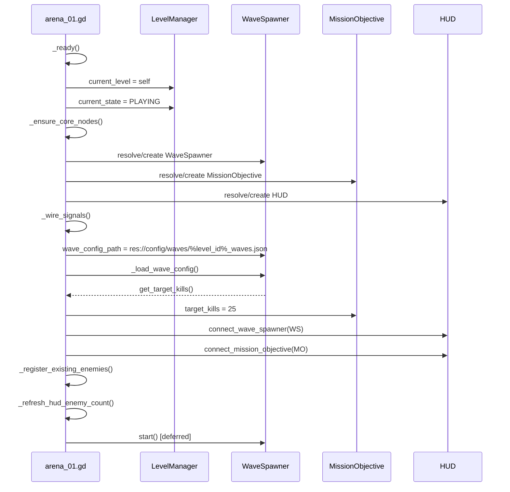
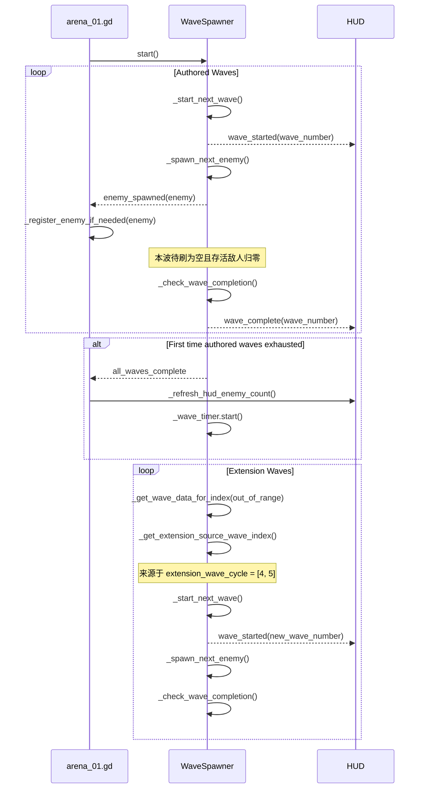
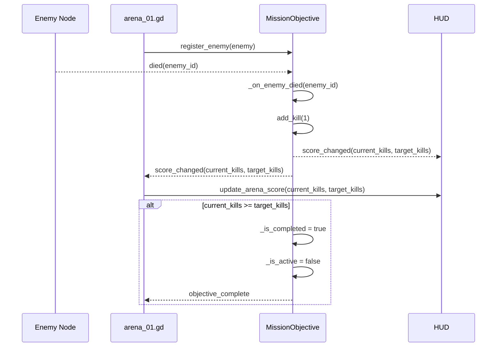
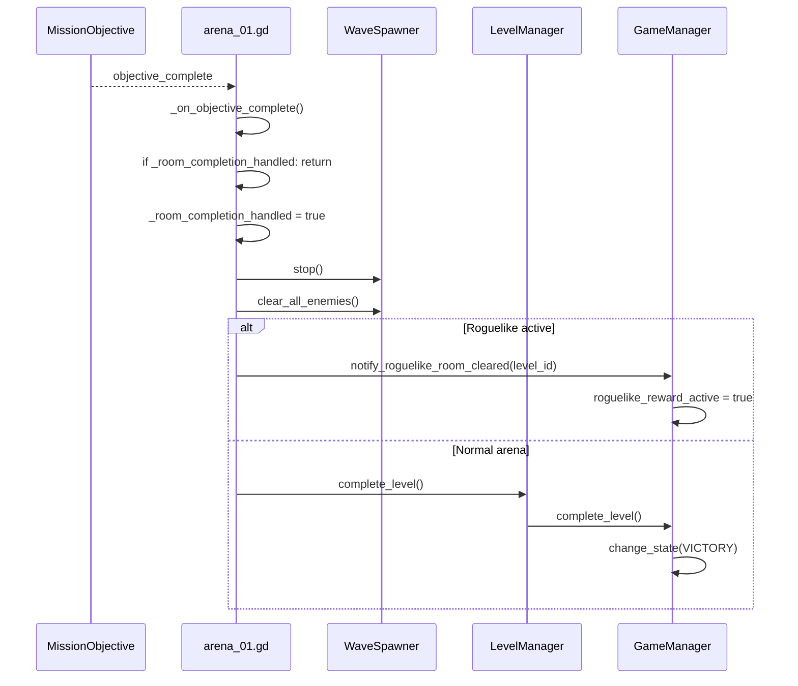

# Arena 击杀配额 / 补刷 / 清关时序图

> **适用模块**: `src/levels/arena_01.gd`, `src/levels/wave_spawner.gd`, `src/levels/mission_objective.gd`
> **最后更新**: 2026-04-01
> **适用关卡**: `arena_01`, `arena_02`

---

## 概述

当前 Arena 流程已经从“清空所有配置波次即可过关”的双重标准，收敛为：

- **唯一清关标准**：`MissionObjective.target_kills` 达成
- **刷波标准**：场上清空后继续下一波；若 authored waves 已耗尽，则进入 extension wave 补刷
- **`all_waves_complete` 含义**：仅表示“手工配置波次已经耗尽”，不再表示关卡完成

当前 `arena_01.tscn` 和 `arena_02.tscn` 都复用共享控制脚本 `src/levels/arena_01.gd`，差异主要来自 `LevelManager.current_level_data.level_id` 决定的波次配置文件：

- `res://config/waves/arena_01_waves.json`
- `res://config/waves/arena_02_waves.json`

---

## 关键职责拆分

### 1. `arena_01.gd`

Arena 场景总控，负责：

- 组织 `WaveSpawner` / `MissionObjective` / HUD
- 把 `WaveSpawner.get_target_kills()` 写入 `MissionObjective.target_kills`
- 监听 `objective_complete` 并统一触发清关 / roguelike 奖励
- 监听 `all_waves_complete`，但**只刷新 HUD，不直接清关**

### 2. `wave_spawner.gd`

刷波执行器，负责：

- 加载 JSON 波次配置
- 顺序执行 authored waves
- authored waves 用尽后，按 `extension_wave_cycle` 循环生成 extension waves
- 在每一波清空时发出：
  - `wave_complete(wave_number)`
  - authored waves 第一次耗尽时发出 `all_waves_complete`

### 3. `mission_objective.gd`

击杀计数器，负责：

- 追踪树中带 `died` 信号的敌人
- 敌人死亡时累计击杀数
- 每次计数变更发出 `score_changed(current, target)`
- 达成 `target_kills` 后发出 `objective_complete`

---

## 配置层

两个 arena 关卡当前都在波次 JSON 中显式配置了：

```json
{
  "target_kills": 25,
  "extension_wave_cycle": [4, 5]
}
```

含义：

- 击杀满 `25` 才能清关
- authored waves 用尽后，继续循环使用第 4、5 波作为补刷来源

`WaveSpawner.get_target_kills()` 会优先读取 `target_kills`；只有配置缺失时才回退到 `get_total_enemy_count()`。

---

## 初始化时序图



### 对应源码

- `src/levels/arena_01.gd::_ready()`
- `src/levels/arena_01.gd::_ensure_core_nodes()`
- `src/levels/arena_01.gd::_wire_signals()`
- `src/levels/wave_spawner.gd::_load_wave_config()`
- `src/levels/wave_spawner.gd::get_target_kills()`

---

## 波次推进 / authored waves → extension waves 时序图



### 对应源码

- `src/levels/wave_spawner.gd::start()`
- `src/levels/wave_spawner.gd::_start_next_wave()`
- `src/levels/wave_spawner.gd::_spawn_next_enemy()`
- `src/levels/wave_spawner.gd::_check_wave_completion()`
- `src/levels/wave_spawner.gd::_get_wave_data_for_index()`
- `src/levels/wave_spawner.gd::_get_extension_source_wave_index()`

### 当前关键语义

- `all_waves_complete` **不再终止 spawner**
- `all_waves_complete` **也不再驱动关卡完成**
- 它只说明 authored waves 已经耗尽一次，之后会继续补刷

---

## 击杀计数时序图



### 对应源码

- `src/levels/mission_objective.gd::register_enemy()`
- `src/levels/mission_objective.gd::_on_enemy_died()`
- `src/levels/mission_objective.gd::add_kill()`
- `src/levels/arena_01.gd::_on_score_changed()`

### 注意点

- 击杀计数来源是**敌人的 `died` 信号**
- 不是 `EnemyManager.total_kills`
- 也不是 `LevelManager.total_enemies`
- 因此 authored wave 总敌人数和通关目标已经解耦

---

## 关卡完成 / roguelike 奖励分流时序图



### 对应源码

- `src/levels/arena_01.gd::_on_objective_complete()`
- `src/levels/wave_spawner.gd::stop()`
- `src/levels/wave_spawner.gd::clear_all_enemies()`
- `src/levels/level_manager.gd::complete_level()`
- `src/autoload/game_manager.gd::notify_roguelike_room_cleared()`
- `src/autoload/game_manager.gd::complete_level()`

---

## 当前实现的真实判断规则

可以把当前规则压缩成下面 4 条：

1. **击杀数未达标时，Arena 不允许清关**
2. **场上清空时，WaveSpawner 必须继续下一波**
3. **authored waves 耗尽后，继续按 `extension_wave_cycle` 补刷**
4. **只有 `MissionObjective.objective_complete` 能触发真正的清关 / 奖励流**

---

## 相关测试

当前这条链路已经有明确回归覆盖：

### Unit

- `tests/unit/test_wave_spawner_progression.gd`
  - `get_target_kills()` 优先读取配额
  - authored waves 耗尽后 spawner 继续运行
  - extension wave 按 cycle 轮转

### Integration

- `tests/integration/test_arena_progression_flow.gd`
  - `all_waves_complete` 不清关
  - `objective_complete` 才清关
  - roguelike 房间完成走奖励流而不是普通 Victory

---

## 后续可选增强

如果后面要继续扩展这条链路，推荐优先级如下：

1. 把共享脚本 `arena_01.gd` 重命名为更准确的 `arena_level.gd` 或 `arena_controller.gd`
2. 如果别的系统也需要消费 `all_waves_complete`，考虑把它重命名为更准确的 `authored_waves_exhausted`
3. 如果后续要做动态难度，可在 `WaveSpawner` 之上增加：
   - `EnemyPool`：决定刷什么
   - `WaveScaling`：决定刷多难

当前实现下，`WaveSpawner` 仍然是唯一刷怪执行器，`EnemyPool` / `WaveScaling` 只应作为配置与决策层，而不是第二套生成器。
